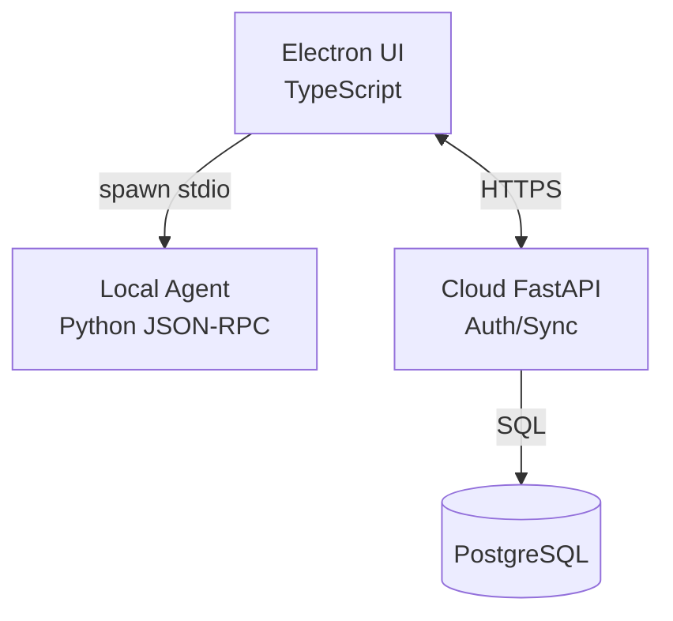
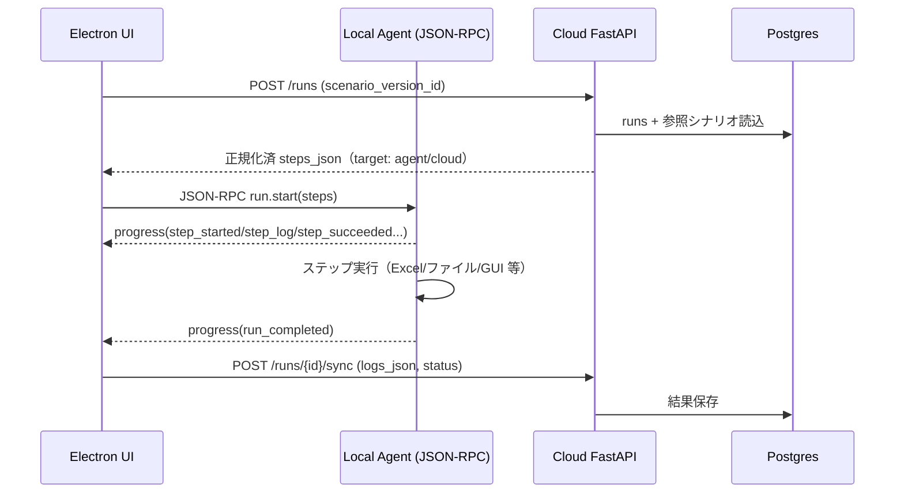

4ピース（Electron / JSON-RPC over stdio Agent / Cloud FastAPI / DB）の**役割分担が一目で分かる**構成にします。実行系はローカル、共有・認可はクラウドという"ハイブリッド"。

# 全体像（役割と責務）

| コンポーネント                                       | 主要責務                                                         | しないこと                   |
| --------------------------------------------- | ------------------------------------------------------------ | ----------------------- |
| **Electron (TS/React)**                       | シナリオ作成/編集、実行ボタン、進捗ログ可視化、クラウド同期、**Agent子プロセス spawn**          | ExcelやGUI自動化などの実処理は持たない |
| **Local Agent (Python, JSON-RPC over stdio)** | 端末内の**全ステップ実行**（Excel/ファイル/アプリ起動/GUI操作）。型検証(Pydantic)、イベント通知 | ネットワーク公開、クラウド認証・多ユーザ管理  |
| **Cloud FastAPI**                             | 認証/認可、シナリオと実行履歴の**保存・共有**、ライセンス、チーム機能、（必要時）外部SaaS連携          | 端末ローカルI/Oの実行            |
| **DB (PostgreSQL)**                           | スキーマ保持、履歴・監査、ステップカタログ                                        | ビジネスロジック                |

---

# トポロジ（接続関係）



* **Electron ⇄ Agent**：ポート不要・CORS不要の **stdio**（JSON-RPC）。高速・安全・配布が簡単
* **Electron ⇄ Cloud**：HTTPS/Token（認証・同期のみ）
* **Cloud ⇄ DB**：Postgres（提示スキーマ＋任意拡張）

---

# 実行フロー（最小）




---

# インターフェース設計

## 1) Electron ↔ Local Agent（JSON-RPC over stdio）

* **リクエスト（実行開始）**

```json
{"jsonrpc":"2.0","id":"1","method":"run.start","params":{
  "run_id":"<uuid>",
  "steps":[
    {"id":"s1","ref":"os.app_launch@1","target":"agent",
     "params":{"path":"C:/.../EXCEL.EXE","args":["/r","C:/tmp/report.xlsx"]}},
    {"id":"s2","ref":"excel.write_cells@1","target":"agent",
     "params":{"path":"C:/tmp/report.xlsx","sheet":"Sheet1","values":{"B2":123}}}
  ]
}}
```

* **通知（進捗・ログ・完了）**

```json
{"jsonrpc":"2.0","method":"progress","params":{"run_id":"...","event":"step_started","index":1,"ref":"os.app_launch@1"}}
{"jsonrpc":"2.0","method":"progress","params":{"run_id":"...","event":"step_succeeded","index":2,"output":{"updated":["B2"]}}}
{"jsonrpc":"2.0","method":"progress","params":{"run_id":"...","event":"run_completed","status":"succeeded"}}
```

* **代表メソッド**

  * `step.catalog`（利用可能ステップ一覧＋param\_schema）
  * `run.start`, `run.cancel`
  * `fs.pick`（必要ならUI経由でファイル選択権限を明示）

## 2) Electron ↔ Cloud FastAPI（HTTPS）

* `POST /auth/login`：認証（トークン発行）
* `GET /scenarios` / `POST /scenarios`
* `GET /scenarios/{id}/versions` / `POST /scenario_versions`
* `POST /runs`：実行要求（Cloud側で steps\_json を正規化して返却）
* `POST /runs/{id}/sync`：ローカル実行結果の同期（`status`, `logs_json` など）
* `GET /runs/{id}` / `GET /runs/{id}/steps`：履歴参照

> **方針**：クラウドは**実行しない**（target=cloud のステップのみサーバ側で代理実行。例：外部SaaSへPOST）

---

# ステップ実装（100% Python）

* Excel：`openpyxl/pandas/xlsxwriter`（直接編集）、必要時 `xlwings`（実アプリ制御）
* アプリ起動：`subprocess.Popen`（Win/macOS対応）
* GUI自動化：`pywinauto`/`pyautogui`（最小限）
* すべて **Pydantic** でパラメータ定義 → **JSON Schema**を `step_catalog` に同期 → Electron が**フォーム自動生成**

---

# 起動・配布

* **Electron**：`electron-builder`（Win/Mac両対応）、`contextIsolation: true`、preloadでIPC allowlist
* **Local Agent**：`pyinstaller` で単一バイナリ化 → **Electron 同梱**

  * 起動時：`child_process.spawn(agentPath, ["--stdio"])`
  * 監視：異常終了時の再起動、メッセージ境界（改行/長さヘッダ）に注意
* **Cloud**：FastAPI + Uvicorn/Gunicorn、CDN越しHTTPS、OpenAPI/Swagger
* **DB**：Postgres（マイグレーションは Alembic）

---

# セキュリティと権限

* **ローカル実行の明示的許可**：ステップごとに `permissions: ["app_launch","file_access","network"]` を宣言 → 初回許諾をUI表示
* **Cloudトークン**：Electronは短命アクセストークンを保持、更新はリフレッシュトークン
* **Agent**：ネットワーク未開放（stdioのみ）。必要時だけ Electron から起動
* **署名**：Winコードサイン／macOSノータライズを導入

---

# ディレクトリ例（概要）

```
app/
  electron/
    src/            # UI/エディタ/プレビュー
    preload/        # IPC橋渡し
    main/           # 子プロセスspawn・RPCハンドラ
    agent-bin/      # 同梱された PyInstaller 生成バイナリ
  cloud/
    api/            # FastAPI（認証・CRUD・同期）
    models/         # SQLAlchemy
    migrations/     # Alembic
  agent/
    steps/          # excel.py, os.py, gui.py ...
    rpc/            # stdio JSON-RPC server
    runner/         # DAG/逐次ランナー、イベント発火
```

---

# これで分かること

* **Electron**＝UIとオーケストレーション
* **Local Agent**＝実処理のエンジン（JSON-RPC/stdioで安全に直結）
* **Cloud FastAPI**＝共有・認可・履歴管理
* **DB**＝スキーマと監査の土台

