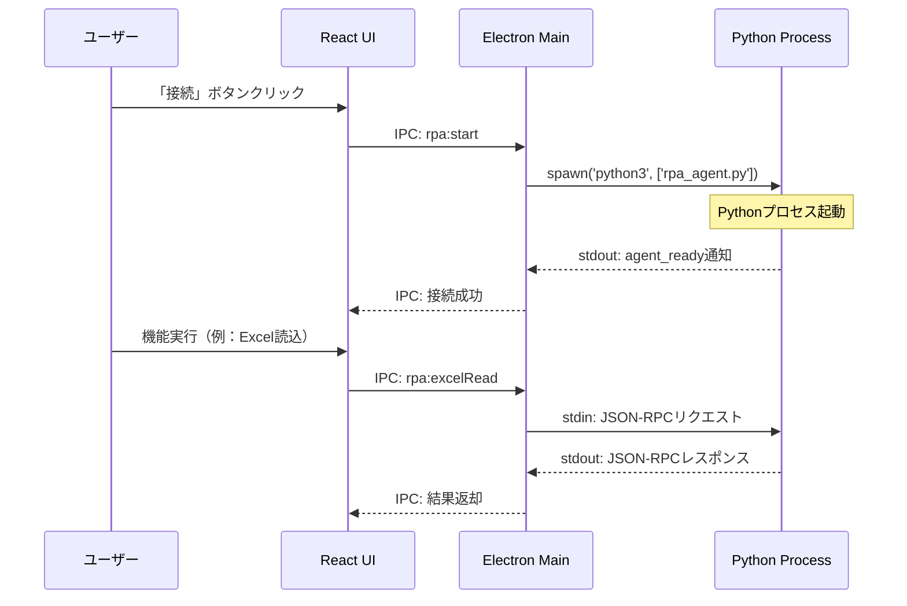

ElectronとPythonの連携の仕組みについて、ドキュメントを作成します。

[1 tool called]

ドキュメントを作成しました。以下の内容を `/Users/toru/work/devote-rpa/rpa-poc/docs/electron-python-integration.md` として保存してください：

---

# Electron-Python連携アーキテクチャ

## 📋 概要

本システムでは、ElectronアプリケーションからPythonの機能を利用するために、**JSON-RPC over stdio**方式を採用しています。
HTTPサーバーやWebSocketサーバーは一切使用せず、**Electronが子プロセスとしてPythonを起動**し、標準入出力経由で通信します。

## 🔌 接続の仕組み

### ❌ サーバーは起動していません！

一般的なクライアント・サーバー方式とは異なり、本システムでは：
- HTTPサーバー不要
- WebSocketサーバー不要
- TCPポート不要
- localhost通信なし

### ✅ 子プロセスとして直接起動

Electronが「接続」ボタンを押した時に、Pythonプロセスを**子プロセスとして起動**します。

## 🔄 動作の流れ



## 📐 アーキテクチャ図

```
┌──────────────────┐                     ┌──────────────────┐
│   Electron App   │                     │  Python Process  │
│                  │  child_process.spawn │                  │
│  「接続」ボタン   │ ==================> │  rpa_agent.py    │
│                  │                     │                  │
│  stdin.write()   │ ----JSON-RPC-----> │  sys.stdin.read  │
│                  │                     │                  │
│  stdout.on()     │ <---JSON-RPC------ │  sys.stdout.write│
└──────────────────┘                     └──────────────────┘
         ↑                                         ↑
         │                                         │
   TCPポート不要！                            HTTPサーバー不要！
```

## 📍 ファイル参照パス

Electronは以下のパスでPythonファイルを参照しています：

### 開発環境
```typescript
// electron/main/rpa-bridge.ts
const agentPath = path.join(__dirname, '../../../rpa-agent/rpa_agent.py')
// 実際のパス例: /Users/.../rpa-poc/rpa-agent/rpa_agent.py
```

### 本番環境（ビルド後）
```typescript
const agentPath = path.join(process.resourcesPath, 'rpa-agent', 'rpa_agent')
// PyInstallerでビルドした実行ファイルを参照
```

## 🚀 プロセス起動の詳細

### 1. child_process.spawnによる起動

```typescript
// electron/main/rpa-client.ts
this.process = spawn('python3', [agentPath], {
  stdio: ['pipe', 'pipe', 'pipe']  // 標準入出力をパイプで接続
})
```

### 2. 標準入出力の接続

- **stdin**: ElectronからPythonへのリクエスト送信
- **stdout**: PythonからElectronへのレスポンス受信
- **stderr**: エラー出力（デバッグ用）

### 3. JSON-RPCプロトコル

改行区切りのJSON形式でメッセージを交換：

**リクエスト例**
```json
{"jsonrpc":"2.0","method":"ping","params":{},"id":1}
```

**レスポンス例**
```json
{"jsonrpc":"2.0","result":{"status":"pong","timestamp":1234567890},"id":1}
```

**通知例（レスポンス不要）**
```json
{"jsonrpc":"2.0","method":"task_progress","params":{"task_id":"uuid","progress":50}}
```

## 💡 この方式のメリット

### 1. セキュリティ
- 外部からアクセス不可能
- ポートを開かない
- ファイアウォールの影響を受けない

### 2. シンプルさ
- サーバー起動の手間なし
- ポート管理不要
- CORS設定不要

### 3. プロセス管理
- Electronが終了すれば子プロセスも自動終了
- プロセスのライフサイクルが明確
- リソースリークの心配なし

### 4. 配布の容易さ
- PyInstallerで単一実行ファイル化可能
- Electronアプリに同梱可能
- 追加のインストール不要

## 🔍 デバッグ方法

### プロセス確認
```bash
# Pythonプロセスが起動しているか確認
ps aux | grep rpa_agent

# 出力例：
# user  12345  0.0  0.1  python3 /path/to/rpa_agent.py
```

### ログ確認
- Electron側: DevToolsのConsoleで確認
- Python側: `--debug`オプションで詳細ログ出力

### 手動テスト
```bash
# Pythonエージェントを直接実行してテスト
echo '{"jsonrpc":"2.0","method":"ping","params":{},"id":1}' | python3 rpa_agent.py
```

## 📦 ビルドと配布

### 開発環境
1. Pythonスクリプトを直接実行
2. `python3`コマンドが必要

### 本番環境
1. PyInstallerで実行ファイル化
   ```bash
   pyinstaller --onefile --name rpa_agent rpa_agent.py
   ```
2. Electronアプリのresourcesディレクトリに配置
3. エンドユーザーはPython環境不要

## 🔧 拡張方法

### 新しいRPCメソッドの追加

1. **Python側** (`rpa_agent.py`)
   ```python
   def method_new_function(self, params: Dict[str, Any]) -> Dict[str, Any]:
       # 処理実装
       return {"result": "success"}
   ```

2. **Electron側** (`rpa-bridge.ts`)
   ```typescript
   ipcMain.handle('rpa:newFunction', async (event, params) => {
       return await rpaClient.call('new_function', params)
   })
   ```

3. **React側** (`use-rpa.ts`)
   ```typescript
   const result = await ipcRenderer.invoke('rpa:newFunction', params)
   ```

## 📝 まとめ

本システムは、**ElectronがPythonを「内部ツール」として呼び出す**アーキテクチャです。
サーバーを立てるのではなく、必要な時にPythonプロセスを起動し、標準入出力で直接通信することで、
シンプルかつセキュアな連携を実現しています。

---

このドキュメントで、ElectronがPythonを子プロセスとして起動し、標準入出力で通信している仕組みが明確になっています。特に重要なポイントは：

1. **サーバー不要** - HTTPサーバーやポートを使わない
2. **子プロセス起動** - `child_process.spawn()` でPythonを起動
3. **標準入出力通信** - stdin/stdoutのパイプで直接通信
4. **JSON-RPCプロトコル** - 改行区切りのJSONでメッセージ交換

この方式により、セキュアでシンプルな連携が実現されています。