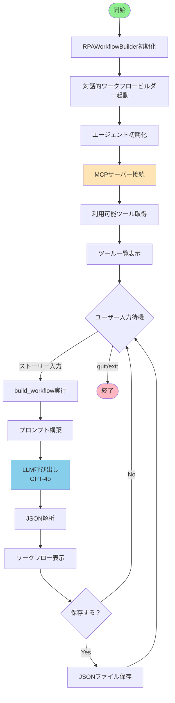

```mermaid
graph TB
    Start([開始]) --> Init[RPAWorkflowBuilder初期化]
    Init --> Interactive[対話的ワークフロービルダー起動]
    
    %% 対話的ビルダーの処理
    Interactive --> InitAgent[エージェント初期化]
    InitAgent --> ConnectMCP[MCPサーバー接続]
    ConnectMCP --> LoadTools[利用可能ツール取得]
    LoadTools --> ShowTools[ツール一覧表示]
    ShowTools --> InputLoop{ユーザー入力待機}
    
    InputLoop -->|ストーリー入力| BuildWF[build_workflow実行]
    InputLoop -->|quit/exit| End([終了])
    
    BuildWF --> CreatePrompt[プロンプト構築]
    CreatePrompt --> CallLLM[LLM呼び出し<br/>GPT-4o]
    CallLLM --> ParseJSON[JSON解析]
    ParseJSON --> DisplayWF[ワークフロー表示]
    DisplayWF --> SaveCheck{保存する？}
    SaveCheck -->|Yes| SaveFile[JSONファイル保存]
    SaveCheck -->|No| InputLoop
    SaveFile --> InputLoop
    
    style Start fill:#90EE90
    style End fill:#FFB6C1
    style CallLLM fill:#87CEEB
    style ConnectMCP fill:#FFE4B5
```